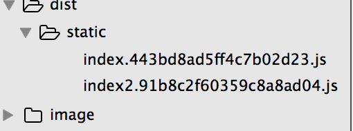

### 1.webpack打包策略分析

#### 1.1 单入口文件

通过下面的打包结果，并结合下面说的多入口文件打包问题，应该是不难理解的。

```js
/************************************************************************/
/******/ ([
/* 0 */
/***/ function(module, exports, __webpack_require__) {
      module.exports = __webpack_require__(1);
/***/ },
/* 1 */
/***/ function(module, exports, __webpack_require__) {
       var util1 = __webpack_require__(2)
       var util2 = __webpack_require__(3)
/***/ },
/* 2 */
/***/ function(module, exports, __webpack_require__) {
      var util2 = __webpack_require__(3)
/***/ },
/* 3 */
/***/ function(module, exports) {
    module.exports = {"name": "util2.js"}

/***/ }
/******/ ]);
```

这里只是需要注意一点，就是`虽然有entry.js和util1.js同时引用了util2模块，但是我们最终也只会为util2生成一个id`！webpack打包的原理为，在入口文件中，对每个require资源文件配置一个id, 也 就是说，对于同一个资源,就算是require多次的话，它的id也是一样的，所以无论在多少个文件中 require，它都只会打包一份。


#### 1.2 多入口文件打包分析

##### 1.2.1 多入口文件打包ID分配

首先webpack.config.js配置如下:

```js
 var path = require('path')
var HtmlWebpackPlugin = require('html-webpack-plugin')
var ExtractTextPlugin = require('extract-text-webpack-plugin')
var webpack = require('webpack')
module.exports = {
    entry: {
        index: ['./src/js1/entry.js'],   //配置两个入口
        index2: ['./src/js1/entry2.js']
    },
    output: {
        path: path.resolve(__dirname, './dist/static'),
        publicPath: 'static/',
        filename: '[name].[chunkhash].js'
    },
    resolve: {
         extensions: ['', '.js', '.less', '.swig', '.html']
    },
    module: {
        loaders: [
        ]
    },
    plugins: [
    ]
}

```

此时会在./dist/static目录中生成两个文件，分别对应于index.[chunkhash].js和index2.[chunkhash].js。



其中index.[chunkhash].js文件内容如下:

```js
/************************************************************************/
/******/ ([
/* 0 */
/***/ function(module, exports, __webpack_require__) {
        module.exports = __webpack_require__(1);
/***/ },
/* 1 */
/***/ function(module, exports, __webpack_require__) {
    var util1 = __webpack_require__(2)
    var util2 = __webpack_require__(3)
/***/ },
/* 2 */
/***/ function(module, exports, __webpack_require__) {
       var util2 = __webpack_require__(3)
/***/ },
/* 3 */
/***/ function(module, exports) {
        module.exports = {"name": "util2.js"}
/***/ }
/******/ ]);
```

很显然，入口文件的id是1,而入口文件引用的资源的id依次增加。同时注意一点：

```js
/* 0 */
/***/ function(module, exports, __webpack_require__) {
        module.exports = __webpack_require__(1);
/***/ },
```

也就是id为0的打包模块其实是对入口文件调用的模块，其中通过module.exports对外导出!

其中index2.[chunkhash].js文件内容如下:

```js
/************************************************************************/
/******/ ([
/* 0 */
/***/ function(module, exports, __webpack_require__) {
         module.exports = __webpack_require__(4);
/***/ },
/* 1 */,
/* 2 */,
/* 3 */
/***/ function(module, exports) {
        module.exports = {"name": "util2.js"}
/***/ },
/* 4 */
/***/ function(module, exports, __webpack_require__) {
      var util2 = __webpack_require__(3)
     setTimeout(function() {console.log(util2.name), 2000})
/***/ }
/******/ ]);
```

首先，和上面分析的一样，我们对入口文件调用的模块id是0，通过module.exports向外导出。

```js
/* 4 */
/***/ function(module, exports) {
  // removed by extract-text-webpack-plugin
/***/ },
/* 5 */,
/* 6 */,
/* 7 */,
/* 8 */
/***/ function(module, exports) {
  // removed by extract-text-webpack-plugin
/***/ },
/* 9 */,
/* 10 */
/***/ function(module, exports) {

  // removed by extract-text-webpack-plugin

/***/ }
```

很清楚的知道id为5，6，7，8的情况没有被分配，因为没有被打包进来，这在单入口文件中也是存在的，而和extract-text-webpack-plugin没有关系！而之所以是这样，`我猜测（需要证实）是webpack在打包的过程中自己生成了很多文件，而这些文件也分配了ID值，但是在我们的文件中并不需要这些模块，所以就没有引入为空`！这可能和webpack自身的功能有关系。

##### 1.2.2 多入口文件打包结果

下面给出了控制台打包信息:


其中asset部分就是生产的文件的文件名，是name+chunkhash的格式;chunks就是对生成的文件的数字标注(chunkid);chunkName就是我们在webpack配置中指定;


结合上面的分析很容易知道，对于入口文件调用的模块Asset(打包资源)部分都是0,而其余资源的部分都是webpac打包后生成的id值！


##### 1.2.3 CommonChunkPlugin插件作用

之前提到过，每个入口文件，都会独立打包自己依赖的模块，那就会造成很多重复打包的模块，有没有一种方法 能把多个入口文件中，共同依赖的部分给独立出来呢？ 肯定是有的 CommonsChunkPlugin

这个插件使用非常简单，它原理就是把多个入口共同的依赖都给定义成`一个新入口`。为何我这里说是定义成新入口呢，因为这个名字不仅仅对应着js 而且对于着和它相关的css等，比如 HtmlWebpackPlugin 中 就能体现出来，可以它的 chunks中 加入 common 新入口，它会自动把common 的css也导入html

##### 什么是chunkid?

可以参见控制台的部分：


从图中可以看到，我们最终输出的common.js也是会有自己独立的chunkid的(也就是chunks列)，虽然我们在webpack的entry配置中并没有指明(每个chunkid对应的是一个js文件):

```js
entry: {
    index: ['./src/js1/entry.js'],   
    index2: ['./src/js1/entry2.js']
  },
```

这是CommonChunkPlugin插件完成的。为何要出来一个chunkid呢？ 这个chunkid的作用就是，标记这个js文件是否已经加载过了。我们首先分析下这个plugin抽取出来的多个入口公共的代码部分:

```js
/******/ (function(modules) { // webpackBootstrap
/******/  // install a JSONP callback for chunk loading
/******/  var parentJsonpFunction = window["webpackJsonp"];
/******/  window["webpackJsonp"] = function webpackJsonpCallback(chunkIds, moreModules) {
/******/    // add "moreModules" to the modules object,
/******/    // then flag all "chunkIds" as loaded and fire callback
/******/    var moduleId, chunkId, i = 0, callbacks = [];
/******/    for(;i < chunkIds.length; i++) {
/******/      chunkId = chunkIds[i];
/******/      if(installedChunks[chunkId])//非0表示没有加载完成,否则是数组，数组元素是函数
/******/        callbacks.push.apply(callbacks, installedChunks[chunkId]);
/******/      installedChunks[chunkId] = 0;//加载完成
/******/    }
/******/    for(moduleId in moreModules) {
/******/      modules[moduleId] = moreModules[moduleId];
/******/    }//modules中得到的都是函数，in遍历数组的时候key是下标,此处modules存储的是键值是每一个函数
/******/    if(parentJsonpFunction) parentJsonpFunction(chunkIds, moreModules);
                 //首先调用父级jsonpFunction
/******/    while(callbacks.length)
/******/      callbacks.shift().call(null, __webpack_require__);
                     //得到callback数组中的函数并调用，每一个回调函数传入一个__webpack_require__就可以了
/******/    if(moreModules[0]) {
/******/      installedModules[0] = 0;
/******/      return __webpack_require__(0);
/******/    }
                //加载第一个模块0，这个模块是我们的入口文件的exports对象，相当于执行模块了!其他的模块只是打包进去，这个0表示直接执行了
/******/  };

/******/  // The module cache
/******/  var installedModules = {};

/******/  // object to store loaded and loading chunks
/******/  // "0" means "already loaded"
/******/  // Array means "loading", array contains callbacks
            //如果是正在加载那么这里就是一个数组，而且数组中包含的是回调函数
/******/  var installedChunks = {
/******/    2:0 //common.js的chunkID是2表示一开始的时候就加载完成，因为他是通用模块必须先加载，然后加载其他的
/******/  };

/******/  // The require function
/******/  function __webpack_require__(moduleId) {

/******/    // Check if module is in cache
                //判断是否在缓存中存在
/******/    if(installedModules[moduleId])
/******/      return installedModules[moduleId].exports;

/******/    // Create a new module (and put it into the cache)
/******/    var module = installedModules[moduleId] = {
/******/      exports: {},
/******/      id: moduleId,
/******/      loaded: false
/******/    };

/******/    // Execute the module function
                //入口执行模块是函数签名是function(module, exports, __webpack_require__) 
/******/    modules[moduleId].call(module.exports, module, module.exports, __webpack_require__);

/******/    // Flag the module as loaded
                //模块加载完成
/******/    module.loaded = true;

/******/    // Return the exports of the module
/******/    return module.exports;
/******/  }

/******/  // This file contains only the entry chunk.
/******/  // The chunk loading function for additional chunks
/******/  __webpack_require__.e = function requireEnsure(chunkId, callback) {
/******/    // "0" is the signal for "already loaded"
/******/    if(installedChunks[chunkId] === 0)
/******/      return callback.call(null, __webpack_require__);
/******/    // an array means "currently loading".
/******/    if(installedChunks[chunkId] !== undefined) {
/******/      installedChunks[chunkId].push(callback);
/******/    } else {
/******/      // start chunk loading
/******/      installedChunks[chunkId] = [callback];
/******/      var head = document.getElementsByTagName('head')[0];
/******/      var script = document.createElement('script');
/******/      script.type = 'text/javascript';
/******/      script.charset = 'utf-8';
/******/      script.async = true;

/******/      script.src = __webpack_require__.p + "" + chunkId + "." + ({"0":"index","1":"index2"}[chunkId]||chunkId) + "." + {"0":"2a3a9ad51d7007de1a89","1":"e7a73c1617697d3e2912"}[chunkId] + ".js";
/******/      head.appendChild(script);
/******/    }
/******/  };

/******/  // expose the modules object (__webpack_modules__)
            //向外导出的modules包含了common.js这个文件，同时也包含我们的moreModules数组中的modules
/******/  __webpack_require__.m = modules;

/******/  // expose the module cache
            //webpack缓存模块
/******/  __webpack_require__.c = installedModules;

/******/  // __webpack_public_path__
            //webpack的__webpack_public_path__
/******/  __webpack_require__.p = "static/";
/******/ })
/************************************************************************/
/******/ ({

/***/ 3:
/***/ function(module, exports) {

  module.exports = {"name": "util2.js"}


/***/ }

/******/ });
```

（1）webpackJsonp第一个参数是chunkId，但是我们的CommonChunkPlugin抽取出来的部分是作为modules参数传入的(在webpack中每一个文件都是一个chunk,所以这个common.js也有自己的chunkid)，而且是一个`引用`，所以每次加载一个chunk的时候,他们引用的都是同一个(防止一个页面重复加载一个模块的代码，如多次加载jQuery)。

 (2)这里要看清楚什么是chunk，什么是module，在webpackJsonp这个函数中第一个参数就是chunkId对应于chunk，而而第二个参数就是chunk中被打包进去的多个module,这也是为什么下面的webpackJsonpCallback的函数签名是如下：

 ```js
 webpackJsonpCallback(chunkIds, moreModules)
 ```

但是仔细想想，我们的common.js其实更像是一个module而不是chunk(因为他会被modules形参接受)。但是从控制台中的输出你可以知道其实webpack已经把它当做chunk了(webpack中每一个文件都是一个chunk)。我们common.js虽然没有在entry中配置，但是我们实际上在common.js中被当做自执行函数的参数传入最后放在modules中，以后再每一个chunk中require公有的这个文件的时候就直接require这个参数指定的内容就可以了

 (3)modules集合最终得到的是一个chunk中所有的moreModules（该chunk独有的module）以及共有的commmon.js这个module（执行的时候只要运行moreModules[0]就可以了）。每次加载一个chunk，其modules最终都会包含我们的CommonChunkPlugin抽取出来的部分。例如我们的[例子](https://github.com/liangklfangl/webpack-chunkfilename)，直接执行下面代码:

```js
webpack --profile --json > stats.json
```

然后在[visualizer](http://webpack.github.io/analyse/#chunks)中打开你就会看到如下的图形:


我们知道chunkId为0，1的模块父级chunk是'main'，而'main'的父级chunk是'vendor'，其实我这里关心的是打包后的代码，其如下:

0.bundle.js(只是含有非公有代码部分)

```js
webpackJsonp([0,3],[
/* 0 */,
/* 1 */
/***/ (function(module, exports, __webpack_require__) {})])

"use strict";
```

其表示我们的0.bundle.js也会加载common.js

1.bundle.js(只是含有非公有代码部分)

```js
webpackJsonp([1,3],[
/* 0 */
/***/ (function(module, exports, __webpack_require__) {

"use strict";})])

```

其表示我们的1.bundle.js也会加载common.js

bundle.js(业务逻辑代码)

```js
webpackJsonp([2,3],{
/***/ 2:
/***/ (function(module, exports, __webpack_require__) {

"use strict";
//code splitting
if (document.querySelectorAll('a').length) {
    __webpack_require__.e/* require.ensure */(1).then((function () {
        var Button = __webpack_require__(0).default;
        var button = new Button('google.com');
        button.render('a');
    }).bind(null, __webpack_require__)).catch(__webpack_require__.oe);
}

if (document.querySelectorAll('h1').length) {
    __webpack_require__.e/* require.ensure */(0).then((function () {
        var Header = __webpack_require__(1).default;
        new Header().render('h1');
    }).bind(null, __webpack_require__)).catch(__webpack_require__.oe);
}
/***/ })

},[2]);
```

其表示我们的bundle.js也会加载common.js,而这里webpackJsonp有三个参数，和上面的webpackJsonp作用具有本质差别。因此，当你加载这个main.js的时候，其并不是马上加载common.js，但是只有满足了这个条件后，加载了其他的chunk都会同时把common.js加载下来，这就达到了按需加载的目的!所以webpackJsonp函数第一个参数数组中的第二个元素后都是表示该chunk依赖的其他的chunk集合!

 （4）__webpack_require__方法最后返回的是modules[moduleId].call(module.exports, module, module.exports, __webpack_require__);也就是执行了id为0的入口文件的exports后得到的对象，这就是这个模块的最后返回值

  （5）在html中必须先加载common.js文件
```js
     <script src="{{ root }}common.js"><\/script>
    <script src="{{ root }}index.js"><\/script>
```

下面是每一个打包后的文件对common.js部分的依赖:

```js
webpackJsonp([1],[
/* 0 */
/***/ function(module, exports, __webpack_require__) {
  module.exports = __webpack_require__(4);
/***/ },
/* 1 */,
/* 2 */,
/* 3 */,
/* 4 */
/***/ function(module, exports, __webpack_require__) {

  var util2 = __webpack_require__(3)
  setTimeout(function() {console.log(util2.name), 2000})

/***/ }
]);
```

通过这里你因该会知道，在执行commonChunkPlugin之前是不存在我们的common.js的，而加上了common.js后，所有的chunk之间的关系都是要维护的!

##### 什么是moduleid?

结合上面的chunkid应该不难理解


### 2.参考资料

[webpack打包原理解析](https://github.com/yongningfu/webpack_package)

